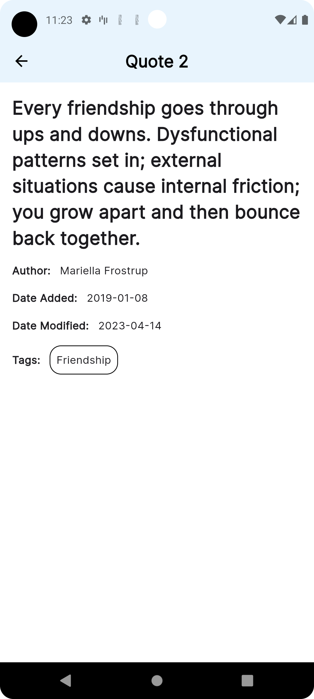

# srijan_flutter_test

A new Flutter project.

## Getting Started

This project is a starting point for a Flutter application.

A few resources to get you started if this is your first Flutter project:

- [Lab: Write your first Flutter app](https://docs.flutter.dev/get-started/codelab)
- [Cookbook: Useful Flutter samples](https://docs.flutter.dev/cookbook)

For help getting started with Flutter development, view the
[online documentation](https://docs.flutter.dev/), which offers tutorials,
samples, guidance on mobile development, and a full API reference.

UI screen shots

##Package used to develop app
================================================
* flutter_riverpod,riverpod - State management used
  - https://pub.dev/packages/flutter_riverpod
  - https://pub.dev/packages/riverpod
  
* google_fonts - fonts used to display
  - https://pub.dev/packages/google_fonts
  
* fluttertoast - to display toast message
  - https://pub.dev/packages/fluttertoast
  
* mockito - for unit test
  - https://pub.dev/packages/mockito
  
* dartz- for Either
  - https://pub.dev/packages/dartz
    
* pretty_dio_logger - to display logs
  - https://pub.dev/packages/pretty_dio_logger

* rxdart - Dart Streams and Controllers 
  - https://pub.dev/packages/rxdart
  
* build_runner - to generate files
  -https://pub.dev/packages/build_runner

* json_serializable - For handling json  
  - https://pub.dev/packages/json_serializable

